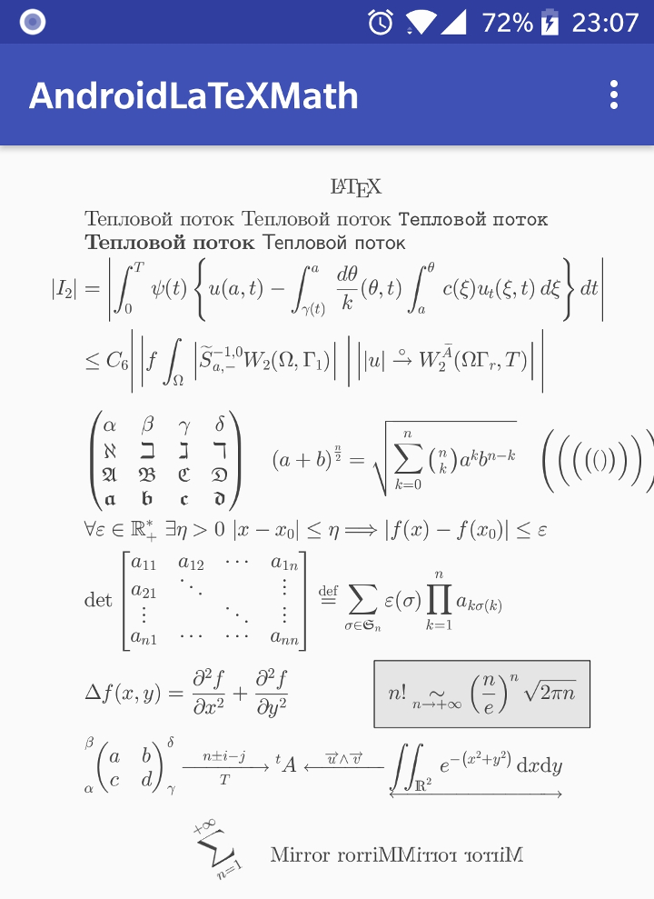

# 

Library for displaying LaTeX formulas on Android. It use [cLaTeXMath](https://github.com/NanoMichael/cLaTeXMath) to parse and render LaTeX code. The picture below demonstrate the demo application.



# Installation

Library is available in jcenter repository, add this script to your build.gradle file to install:

```gradle
implementation 'io.nano:android-tex:1.0.0'
```

# ProGuard

Add the following rule to your proguard config file:

```
-keep class io.nano.tex.** {*;}
```

# How to use

First, initialize the library:

```java
// ... code inside an Activity or Application
@override
public void onCreate() {
    // ... some other code
    // Initialize the LaTeX engine. Call of this function will copy the 
    // "TeX resources" from apk into the data files directory of the
    // host application, and parse the "TeX resources", it may takes a
    // long time, you may call it from a background thread.
    if (!LaTeX.isInitialized()) {
        LaTeX.instance().init(getApplicationContext());
    }
}
```

Then, parse the given LaTeX code:

```java
String code = "\\int_{now}^{\\infty} \\text{Keep trying}";
TeXRender r = LaTeX.instance().parse(
    code,        // LaTeX code to parse
    720,         // logical width of the graphics context (in pixel)
    20,          // font size
    10,          // space between 2 lines (in pixel)
    Color.DKGRAY // foreground color
);
```

Last, just draw it:

```java
@override
protected void onDraw(Canvas canvas) {
    Graphics2D g2 = new Graphics2D();
    g2.setCanvas(canvas);
    // draw the formula on the coordinate (10, 10)
    r.draw(g2, 10, 10);
}
```

Very simple. For more details, please check out the demo app of this project.

# Build by yourself

First make sure you have a NDK that the version must be `>=4.9` installed. Then add the following script to your `local.properties` file:

```
ndk.dir=/your/NDK/dir
```

Update the latest `C++` implementation using `git`:

```sh
git submodule init --recursive
git submodule update --remote
```

Now everything is OK, just build it.

# License

This project is under the [Apache-2.0](http://www.apache.org/licenses/LICENSE-2.0)

```
Copyright 2018 Nano Michael

Licensed under the Apache License, Version 2.0 (the "License");
you may not use this file except in compliance with the License.
You may obtain a copy of the License at

    http://www.apache.org/licenses/LICENSE-2.0

Unless required by applicable law or agreed to in writing, software
distributed under the License is distributed on an "AS IS" BASIS,
WITHOUT WARRANTIES OR CONDITIONS OF ANY KIND, either express or implied.
See the License for the specific language governing permissions and
limitations under the License.
```
